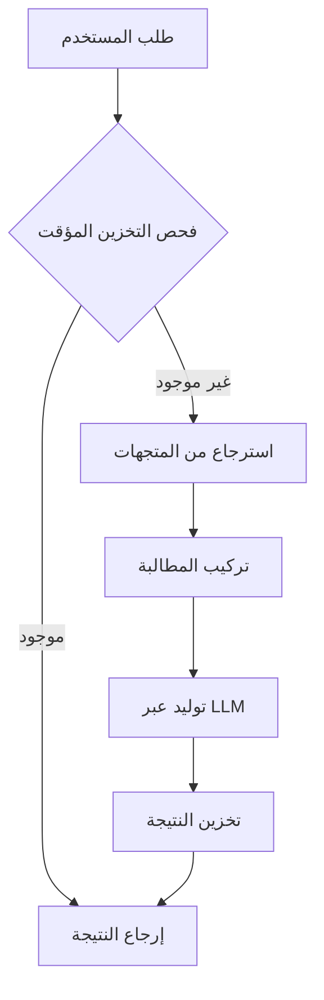

# IRYM SDK: دليل المطور الكامل

مرحباً بك في الدليل التفصيلي لـ IRYM SDK. يغطي هذا الدليل سيناريوهات الاستخدام المحددة وأنماط التكامل لبناء تطبيقات ذكاء اصطناعي جاهزة للإنتاج.

---

## 🛠️ أدلة الخدمات الأساسية

### 1. RAG (توليد المستندات المدعوم بالاسترجاع)
خط إنتاج RAG هو قلب الذكاء المستند إلى المستندات. يدعم أنواع ملفات مختلفة ويعالج نسبة المصادر تلقائياً.

```python
from IRYM_sdk import init_irym, startup_irym, get_rag_pipeline

async def run_rag():
    init_irym()
    await startup_irym()
    # الاستعاب من مصادر متعددة
    await rag.ingest("./docs/")             # ملفات (PDF, MD, TXT, DOCX, XLSX)
    await rag.ingest_url("https://ai.com")  # كاشط الويب
    
    # جديد: استيعاب متقدم
    await rag.ingest_sql(
        connection_string="sqlite:///data.db",
        query="SELECT content, author FROM posts",
        text_column="content"
    )
    
    await rag.ingest_api(
        url="https://api.service.com/v1/news",
        data_path="results.items"
    )
    
    # الاستعلام مع الاستشهادات
    response = await rag.query("كيف يمكنني تكوين مخزن المتجهات؟")
    print(response) # "يمكنك تكوينه في config.py... [المصدر: config.py]"
```

### 2. خدمة الصوت (STT & TTS)
تعامل مع التفاعلات الصوتية باستخدام نماذج محلية أو سحابية.

#### 🎙️ الخدمة المحلية
```python
from IRYM_sdk.audio.local import LocalAudioService
audio = LocalAudioService()
await audio.init()
text = await audio.stt("input.wav")
```

#### ☁️ خدمة OpenAI / السحابية
```python
from IRYM_sdk.audio.openai import OpenAISTT, OpenAITTS
stt = OpenAISTT()
tts = OpenAITTS()
await stt.init()
text = await stt.transcribe("voice.mp3")
```

### 3. خدمة الرؤية (VLM)
قم بتحليل الصور باستخدام نماذج رؤية محلية أو متوافقة مع OpenAI. يعالج خط الإنتاج المتكامل **التخزين المؤقت** و**سياق الـ RAG** تلقائياً.

```python
from IRYM_sdk import init_irym_full, get_vlm_pipeline

async def vision_demo():
    await init_irym_full()
    vlm = get_vlm_pipeline()
    
    # تكامل في 3 أسطر: النموذج + التخزين المؤقت + سياق RAG
    answer = await vlm.ask(
        prompt="صف محتويات هذا الرسم العلمي.", 
        image_path="diagram.jpg",
        use_rag=True
    )
    print(answer)
```

### 4. نظام الذاكرة (سياق المحادثة)
يوحد نظام الذاكرة في IRYM بين **تاريخ المحادثة** (قصير المدى) و**الاسترجاع الدلالي** (طويل المدى) لجعل ذكائك الاصطناعي يتذكر السياق. يتم دمجه وتفعيله تلقائياً عند تمرير `session_id`.

```python
from IRYM_sdk import init_irym_full, get_llm

async def memory_demo():
    await init_irym_full()
    llm = get_llm()
    
    # الجولة الأولى - يتم تخزين التفاعل تلقائياً
    await llm.generate("مرحباً، أنا مطور أقوم ببناء IRYM.", session_id="user_123")
    
    # الجولة الثانية - يتم استرجاع السياق تلقائياً
    response = await llm.generate("ماذا أبني؟", session_id="user_123")
    print(response) # "أنت تبني IRYM!"

### 🚀 إطار عمل عالي المستوى: ChatBot
فئة `ChatBot` هي الحل النهائي لبناء عملاء ذكاء اصطناعي متكاملين في سطر واحد. يقوم بتنظيم خدمات LLM و VLM و RAG والذاكرة والخدمات الصوتية تحت واجهة واحدة بسيطة.

#### 1. واجهة البناء (Builder API)
قم بتكوين عميلك من خلال ربط الوظائف:
```python
from IRYM_sdk import ChatBot

bot = (ChatBot(local=True, vlm=True, tts=True, stt=True)
       .with_rag("./docs")
       .with_memory()
       .build())
```

#### 2. تفاعل متعدد الوسائط
تتعامل وظيفة `chat()` مع مدخلات مختلفة تلقائياً:
- **النص**: `await bot.chat("مرحباً")`
- **الرؤية**: `await bot.chat("اشرح هذا", image_path="diagram.png")`
- **الصوت**: `await bot.chat(audio_path="voice.wav")` (يقوم بالتحويل للنص والرد)

#### 3. سيناريوهات استخدام إطار العمل

##### **أ. مثال بسيط بلغة بايثون (CLI)**
```python
import asyncio
from IRYM_sdk import ChatBot

async def main():
    bot = ChatBot(local=True).with_memory().build()
    print(await bot.chat("مرحباً!"))

if __name__ == "__main__":
    asyncio.run(main())
```

##### **ب. التكامل مع FastAPI**
```python
from fastapi import FastAPI
from IRYM_sdk import ChatBot

app = FastAPI()
bot = ChatBot(vlm=True).with_rag("./data").build()

@app.post("/ask")
async def ask_ai(prompt: str, session: str = "user1"):
    return {"answer": await bot.set_session(session).chat(prompt)}
```

##### **ج. التكامل مع Django**
```python
# views.py
from django.http import JsonResponse
from IRYM_sdk import ChatBot
import asyncio

bot = ChatBot(local=False).with_openai("sk-...").build()

def ai_chat(request):
    txt = request.GET.get('text')
    ans = asyncio.run(bot.chat(txt))
    return JsonResponse({"reply": ans})
```

### ⚠️ هام: متطلبات الأجهزة لموديلات التشغيل المحلي
```

### ⚠️ هام: متطلبات الأجهزة لموديلات التشغيل المحلي
عند استخدام الموديلات المحلية (Ollama أو Transformers)، تأكد من أن جهازك يلبي هذه المتطلبات:

- **LLM (Qwen-1.5B/7B)**: ذاكرة عشوائية (RAM) لا تقل عن 8 جيجابايت. يوصى بـ 16 جيجابايت+ لموديلات 7B.
- **VLM (Moondream/Qwen-VL)**: يتطلب بطاقة رسوميات (GPU) مخصصة بذاكرة لا تقل عن 4 جيجابايت (باستخدام تقليب 4-bit) أو 8 جيجابايت+ للتحميل القياسي.
- **التخزين**: تأكد من توفر مساحة 10 جيجابايت على الأقل لملفات الموديلات.

> [!WARNING]
> تشغيل موديلات كبيرة على أجهزة تعتمد على المعالج (CPU) فقط أو أجهزة ذات ذاكرة منخفضة قد يؤدي إلى بطء شديد أو انهيار النظام. سيطلب منك SDK التأكيد قبل تشغيل الموديلات المحلية ما لم يتم ضبط `AUTO_ACCEPT_FALLBACK=true`.

### التبديل التلقائي والتأكيد (Service Fallback)
يعطي IRYM SDK الأولوية لمزوديك الأساسيين (OpenAI) ولكنه يتضمن تبديلاً قوياً للموديلات المحلية (Ollama/Transformers).

افتراضياً، يتبع SDK مبدأ **السلامة أولاً**: سيطلب منك التأكيد في الوحدة الطرفية (terminal) قبل بدء تشغيل موديل محلي لتجنب استهلاك الموارد غير المتوقع.

لتغيير هذا السلوك للإنتاج أو البيئات غير التفاعلية:
```bash
# .env
AUTO_ACCEPT_FALLBACK=true  # التبديل تلقائياً للمحلي دون سؤال
```

---

## 🏗️ البنية التحتية المتقدمة

### 🔄 إدارة دورة الحياة (Lifecycle Management)
استخدم `LifecycleManager` لتسجيل المهام التي تعمل عند بدء تشغيل التطبيق أو إغلاقه. هذا مثالي لإدارة اتصالات قاعدة البيانات أو تحميل نماذج الذكاء الاصطناعي الثقيلة مرة واحدة.

```python
from IRYM_sdk.core.lifecycle import lifecycle

async def my_startup_task():
    print("Pre-loading resources...")

lifecycle.on_startup(my_startup_task)

# عند بدء تشغيل تطبيقك:
await lifecycle.startup()
```

### 📊 المراقبة والوضوح (Observability)
تسجيل منظم مدمج لمراقبة خدمات الذكاء الاصطناعي الخاصة بك.

```python
from IRYM_sdk.observability.logger import get_logger
logger = get_logger("my_app")

logger.info("بدء معالجة الذكاء الاصطناعي...")
```

---

## 🧜‍♂️ هندسة النظام

