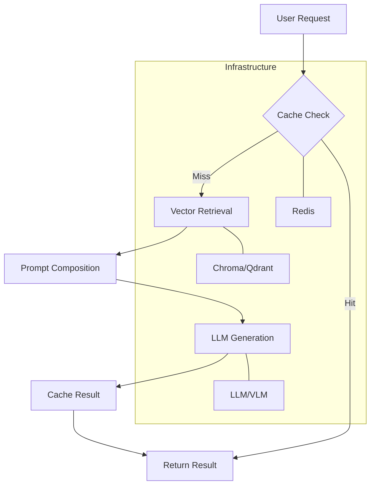

# IRYM SDK: The Complete Developer Guide

Welcome to the deep-dive guide for the IRYM SDK. This guide covers specific usage scenarios and integration patterns for building production AI applications.

---

## 🛠️ Core Service Guides

### 1. RAG (Retrieval Augmented Generation)
The RAG pipeline is the heart of document-based intelligence. It supports various file types and handles source attribution automatically.

```python
from IRYM_sdk import init_irym, startup_irym, get_rag_pipeline

async def run_rag():
    init_irym()
    await startup_irym()
    # Ingest from multiple sources
    await rag.ingest("./docs/")             # Files (PDF, MD, TXT, DOCX, XLSX)
    await rag.ingest_url("https://ai.com")  # Web Scraper
    
    # NEW: Advanced Ingestion
    await rag.ingest_sql(
        connection_string="sqlite:///data.db",
        query="SELECT content, author FROM posts",
        text_column="content"
    )
    
    await rag.ingest_api(
        url="https://api.service.com/v1/news",
        data_path="results.items"
    )
    
    # Query with citations
    response = await rag.query("How do I configure the vector store?")
    print(response) # "You can configure it in config.py... [Source: config.py]"
```

### 2. Audio Service (STT & TTS)
Handle voice interactions with local or cloud-based models.

#### 🎙️ Local Service
```python
from IRYM_sdk.audio.local import LocalAudioService
audio = LocalAudioService()
await audio.init()
text = await audio.stt("input.wav")
```

#### ☁️ OpenAI / Cloud Service
```python
from IRYM_sdk.audio.openai import OpenAISTT, OpenAITTS
stt = OpenAISTT()
tts = OpenAITTS()
await stt.init()
text = await stt.transcribe("voice.mp3")
```

### 3. VLM (Vision Language Models)
Analyze images using local or OpenAI-compatible vision models. The integrated pipeline handles **Caching** and **RAG context** automatically.

```python
from IRYM_sdk import init_irym_full, get_vlm_pipeline

async def vision_demo():
    await init_irym_full()
    vlm = get_vlm_pipeline()
    
    # 3-line integration: Model + Cache + RAG Context
    answer = await vlm.ask(
        prompt="Describe this scientific diagram.", 
        image_path="diagram.jpg",
        use_rag=True
    )
    print(answer)
```

### 4. Memory System (Context Awareness)
The IRYM Memory System unifies **Conversation History** (Short-term) and **Semantic Retrieval** (Long-term) to make your AI stateful. It is automatically integrated and triggered when you pass a `session_id`.

```python
from IRYM_sdk import init_irym_full, get_llm

async def memory_demo():
    await init_irym_full()
    llm = get_llm()
    
    # First turn - Interaction is automatically stored
    await llm.generate("Hi, I'm a developer building IRYM.", session_id="user_123")
    
    # Second turn - Context is automatically retrieved
    response = await llm.generate("What am I building?", session_id="user_123")
    print(response) # "You are building IRYM!"

### 🚀 High-Level Framework: ChatBot
The `ChatBot` class is the ultimate one-liner for building full AI agents. It orchestrates LLM, VLM, RAG, Memory, and Audio services under a single fluent interface.

#### 1. The Builder API
Configure your agent by chaining methods:
```python
from IRYM_sdk import ChatBot

bot = (ChatBot(local=True, vlm=True, tts=True, stt=True)
       .with_rag("./docs")
       .with_memory()
       .build())
```

#### 2. Multi-Modal Interaction
The `chat()` method handles different inputs automatically:
- **Text**: `await bot.chat("Hello")`
- **Vision**: `await bot.chat("Explain this", image_path="diagram.png")`
- **Audio**: `await bot.chat(audio_path="voice.wav")` (Transcribes and responds)

#### 3. Framework Usage Scenarios

##### **A. Simple Python CLI Demo**
```python
import asyncio
from IRYM_sdk import ChatBot

async def main():
    bot = ChatBot(local=True).with_memory().build()
    print(await bot.chat("Hello!"))

if __name__ == "__main__":
    asyncio.run(main())
```

##### **B. FastAPI Integration**
```python
from fastapi import FastAPI
from IRYM_sdk import ChatBot

app = FastAPI()
bot = ChatBot(vlm=True).with_rag("./data").build()

@app.post("/ask")
async def ask_ai(prompt: str, session: str = "user1"):
    return {"answer": await bot.set_session(session).chat(prompt)}
```

##### **C. Django Integration**
```python
# views.py
from django.http import JsonResponse
from IRYM_sdk import ChatBot
import asyncio

bot = ChatBot(local=False).with_openai("sk-...").build()

def ai_chat(request):
    txt = request.GET.get('text')
    ans = asyncio.run(bot.chat(txt))
    return JsonResponse({"reply": ans})
```

### ⚠️ Important: Local Model Hardware Requirements
```

### ⚠️ Important: Local Model Hardware Requirements
When using local models (Ollama or Transformers), ensure your machine meets these requirements:

- **LLM (Qwen-1.5B/7B)**: Minimum 8GB RAM. 16GB+ recommended for 7B models.
- **VLM (Moondream/Qwen-VL)**: Requires a dedicated GPU with at least 4GB VRAM (using 4-bit quantization) or 8GB+ for standard loading.
- **Storage**: Ensure at least 10GB of free space for model weights.

> [!WARNING]
> Running large models on CPU-only machines or low-RAM devices may result in extreme latency or system crashes. The SDK will prompt for confirmation before starting local models unless `AUTO_ACCEPT_FALLBACK=true` is set.

### Service Fallback & Confirmation
IRYM SDK prioritizes your primary providers (OpenAI) but includes a robust fallback to local models (Ollama/Transformers).

By default, the SDK is **Safety-First**: it will prompt you in the terminal for confirmation before starting a local model to avoid unexpected resource usage.

To change this behavior for production or non-interactive environments:
```bash
# .env
AUTO_ACCEPT_FALLBACK=true  # Automatically switch to local without asking
```

---

## 🏗️ Advanced Infrastructure

### 🔄 Lifecycle Management
Use the `LifecycleManager` to register hooks that run on application startup or shutdown. This is ideal for managing database pool connections or loading heavy AI models once.

```python
from IRYM_sdk.core.lifecycle import lifecycle

async def my_startup_task():
    print("Pre-loading resources...")

lifecycle.on_startup(my_startup_task)

# When your app starts:
await lifecycle.startup()
```

### 📊 Observability & Logging
Built-in structured logging for monitoring your AI services.

```python
from IRYM_sdk.observability.logger import get_logger
logger = get_logger("my_app")

logger.info("Starting AI processing...")
```

### 🚨 Error Handling
IRYM provides a typed exception hierarchy for robust error catching.

```python
from IRYM_sdk.core.exceptions import IRYMError, ServiceNotInitializedError

try:
    await rag.query("...")
except ServiceNotInitializedError:
    print("Forgot to call init()!")
```

---

## 🌐 Framework Integrations

### ⚡ FastAPI Integration
FastAPI's asynchronous nature is a perfect fit for IRYM. Use the lifecycle hooks for a clean setup.

```python
from fastapi import FastAPI
from IRYM_sdk import init_irym_full # New helper
from IRYM_sdk.core.lifecycle import lifecycle

app = FastAPI()

@app.on_event("startup")
async def startup():
    await init_irym_full() # Initializes config, DI, and runs lifecycle.startup()

@app.on_event("shutdown")
async def shutdown():
    await lifecycle.shutdown()
```

### 🎸 Django Integration
Integrate IRYM into your Django views.

```python
# views.py
from IRYM_sdk import get_rag_pipeline
import asyncio

def ai_chat(request):
    rag = get_rag_pipeline()
    answer = asyncio.run(rag.query(request.GET.get('q')))
    return JsonResponse({"answer": answer})
```

---

## 🧜‍♂️ System Architecture

