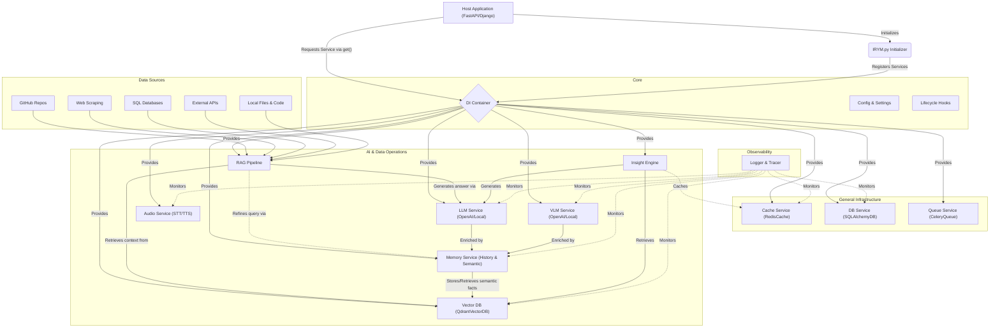

# 🧠 IRYM_sdk (I can Read Your Mind SDK)

A production-ready, modular backend infrastructure SDK designed for AI-powered Python backend services. 

Whether you are building with FastAPI, Django, or a custom event-driven service, **IRYM_sdk** eliminates repetitive backend setup. It provides a unified, interchangeable system for caching, database access, background jobs, LLM integrations, vector databases, and RAG pipelines.

## 🏗️ Architecture Flow

The entire SDK is built around an **Everything is a Service** and **Interface-First** philosophy. Services are centrally managed by a Dependency Injection (DI) system, ensuring complete modularity and avoiding global state collision.



## 🚀 Key Requirements & Core Features

1. **Dependency Injection**: Central standard registry. No manual instantiation inside business logic.
2. **Interface First**: Every module complies with an asynchronous base contract (`BaseCache`, `BaseLLM`, `BaseVectorDB`, etc.).
3. **Flexible Vector DB**: Native support for **ChromaDB** (Default/Persistent) and **Qdrant**.
4. **Embedded Insights**: Pre-configured with `sentence-transformers` (`all-MiniLM-L6-v2`) for local embedding generation.
5. **RAG Orchestration**: All-in-one `RAGPipeline` that handles document loading (.pdf, .docx, .xlsx), SQL databases, external APIs, and web scraping.

## 📦 Installation
Choose the method that fits your workflow best.

### 1. Automated Installation (Recommended)
Get everything ready in one command:
```bash
git clone https://github.com/blackeagle686/IRYM_sdk.git
cd IRYM_sdk
./install.sh
```

### 2. Manual Installation
Alternatively, use the provided `Makefile` or `pip`:
```bash
# Full installation with all services (VDB, RAG, Memory, etc.)
make install-full

# Or basic installation
make install
```

### 3. Local Pip Installation
```bash
pip install .
# Or with extras
pip install ".[full]"
```
3. **Configure Environment Variables**:
   ```env
   OPENAI_API_KEY="your_key"
   VECTOR_DB_TYPE="chroma"             # "chroma" or "qdrant"
   CHROMA_PERSIST_DIR="./chroma_db"
   REDIS_URL="redis://localhost:6379/0" # Required for persistent Memory/Cache
   ```

### 🛠️ System Dependencies
- **Redis Server**: Required for stateful memory and caching.
  - Ubuntu: `sudo apt install redis-server`
  - macOS: `brew install redis`

## 🚀 Framework Mode: High-Level ChatBot

The IRYM SDK now includes a high-level **Framework Layer** that allows you to build complex AI agents with Vision, Speech, RAG, and Memory in just **one line of code**.

```python
from IRYM_sdk import ChatBot

# Build the complete AI Agent with Security and Custom Config
bot = (ChatBot(local=True, vlm=True)
       .with_rag(["./docs", "./src"])       # Folders or files
       .with_memory()                       # Enable session memory
       .with_security(mode="strict")        # Protection against Prompt Injection
       .with_system_prompt("Expert Dev")    # Guide bot behavior
       .build())

# Or switch to OpenAI with one line
# bot.with_openai(api_key="sk-...", base_url="https://api.openai.com")

# Multi-modal interaction
response = await bot.chat("What's in this image?", image_path="vision.jpg")
print(response) 
```
> [!TIP]
> Use `.set_session("user_123")` on the bot instance to switch between different users in production environments like FastAPI.

## 📖 Quickstart: RAG Pipeline

The `RAGPipeline` is the highest-level service for handling document-based knowledge.

```python
import asyncio
from IRYM_sdk import init_irym, startup_irym, get_rag_pipeline

async def rag_demo():
    init_irym()
    await startup_irym()
    rag = get_rag_pipeline()

    # 1. Ingest documents (Supports Docs + Source Code .py, .js, .go, .rs, etc.)
    await rag.ingest("./my_project")

    # 2. Ingest from GitHub Repository (Automated cloning & indexing)
    await rag.ingest_github("https://github.com/blackeagle686/IRYM_sdk.git")

    # 3. Ingest from Web URL
    await rag.ingest_url("https://example.com/docs/api")

    # 4. Query with automatic Citations
    answer = await rag.query("How do I extend the cache layer?")
    print(f"AI Answer: {answer}")
```

### 🧠 Source Attribution
The SDK now automatically instructs the LLM to cite its sources. When you query the RAG pipeline, the response will often include markers like `[Source: cloud.pdf]` or `[Source: https://example.com]`.

## ⚠️ Local Model Hardware Requirements
If you plan to use local inference (Ollama or Transformers), please ensure your system meets these specifications:
- **RAM**: 8GB Minimum (16GB+ recommended).
- **GPU**: 4GB+ VRAM required for VLM models (using 4-bit quantization).
- **Disk**: 10GB+ free space for model storage.

> [!WARNING]
> High-resource models may cause system instability on low-RAM or CPU-only devices. The SDK defaults to a safety-first approach and will prompt for confirmation before starting local providers.

## 🏹 Dynamic Fallbacks & Native PyTorch

IRYM_sdk includes a robust "fail-loud and recover gracefully" orchestration architecture for AI providers:

### 1. Interactive Provider Fallbacks
If your primary provider (e.g. Local) fails to connect or crashes, the SDK's orchestration (`VLMPipeline` / `InsightEngine`) instantly intercepts the failure and prompts you to fallback to the secondary provider (e.g. OpenAI), bypassing pipeline crashes.

### 2. Native PyTorch Singleton Caching (`LocalVLM` & `LocalLLM`)
No `Ollama` server? No problem! The local providers automatically detect if Hugging Face `transformers` is installed and spin up models natively in your local GPU using an optimized Singleton cache.
> **Jupyter/Colab Tip**: If you face persistent `Ollama` warnings after installing `transformers`, run `LocalVLM._model_cache.clear()` or `LocalLLM._model_cache.clear()` in your notebook to wipe the previous state and force a PyTorch native reload.

### 3. Automatic 4-Bit Quantization
To prevent `CUDA Out of Memory` (OOM) errors on smaller GPUs (like Colab T4s), the SDK auto-detects `bitsandbytes` (`pip install bitsandbytes`) and instantly applies `load_in_4bit=True` to shrink massive models (like Qwen2-VL) into your VRAM.

### 4. Resilient RAG PDFs
The `RAGPipeline.ingest()` method supports PDFs robustly by sequentially testing for parsing libraries: `pypdf`, `pymupdf` (`fitz`), `pdfplumber`, and `PyPDF2`. Simply install whichever you prefer (`pip install pymupdf` is recommended for speed) and it works flawlessly!

## 🧠 Advanced Usage: Insight Engine

The `InsightEngine` performs full context retrieval, query rewriting, and LLM generation efficiently.

```python
from IRYM_sdk import init_irym, get_insight_engine

async def insight_demo():
    init_irym()
    insight = get_insight_engine()

    # This invokes: Clean Query -> Vector Search -> Rerank -> LLM Generation
    final_response = await insight.query("How do I extend the cache layer?")
    print(final_response)
```

## 🖼️ Quickstart: VLM (Vision)

The `VLMPipeline` orchestrates vision tasks with automatic caching and RAG.

```python
from IRYM_sdk import init_irym_full, get_vlm_pipeline

async def vision_demo():
    await init_irym_full()
    vlm = get_vlm_pipeline()

    # Integrated: Result Caching + RAG context injection
    answer = await vlm.ask("What is in this image?", "image.png", use_rag=True)
    print(answer)
```
